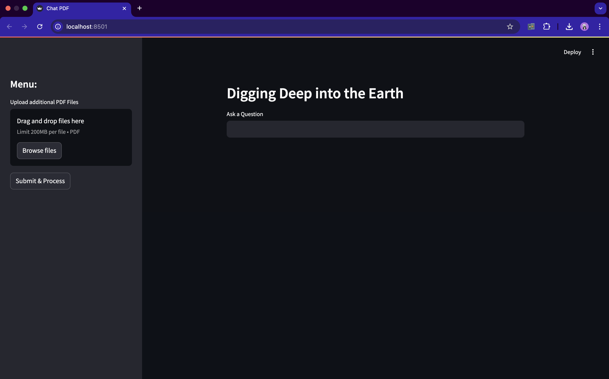
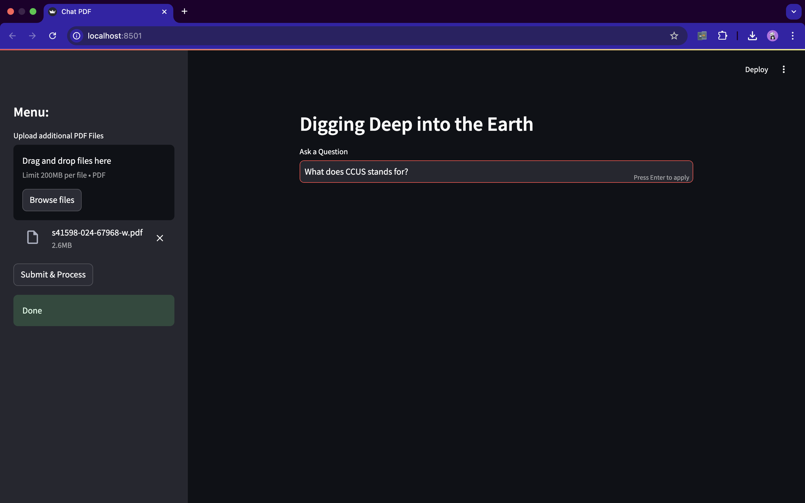
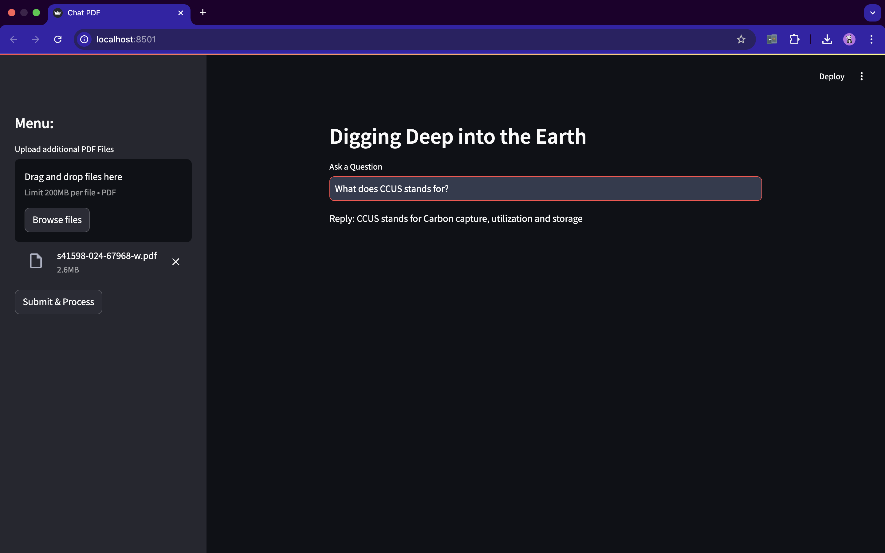

# Geological Text Mining

This project is designed to analyze geological texts by leveraging advanced NLP(RAG) techniques. Users can upload geological PDFs and interactively query the content using a Streamlit-powered web application.

---

## Features
- **PDF Upload and Processing**: Supports uploading multiple PDF files for analysis.
- **Text Chunking and Indexing**: Splits text into manageable chunks and builds a vectorized index using FAISS.
- **Interactive Querying**: Allows users to ask questions and get detailed responses based on the uploaded content.
- **Google Generative AI Integration**: Uses `Gemini Pro` and `embedding-001` models for text embeddings and conversational AI.

---

## Methodology

### 1. **Backend Workflow**
- **PDF Processing**:
  - Extracts text from uploaded PDF files using `PyPDF2`.
  - Splits large text into smaller chunks using `RecursiveCharacterTextSplitter` for efficient indexing.
- **Embedding and Vector Storage**:
  - Generates text embeddings using Google Generative AI models.
  - Builds and saves a FAISS vector index for similarity search.
- **Conversational AI**:
  - Integrates a custom prompt with the `Gemini Pro` model for precise and contextual responses.
  - Handles user questions by searching the FAISS index and generating responses from the most relevant text chunks.

### 2. **Frontend Workflow**
- Built using Streamlit:
  - A user-friendly interface with options to upload and process PDFs.
  - Sidebar for managing files and processing them interactively.
  - Input field for querying the content of the uploaded PDFs.

---

## Installation

### Prerequisites
- Python 3.8 or higher
- Required dependencies (`pip install -r requirements.txt`)

### Steps
1. Clone the repository:
   ```bash
   git clone https://github.com/rajdip-i/Geological-Text-Mining.git
   cd Geological-Text-Mining
2. Install dependencies:
   - pip install -r requirements.txt

3. Add your HuggingFace API key in the .env file:
   - HUGGINGFACEHUB_API_TOKEN=YOUR_API_KEY

4. Run the Flask app:
   - python app.py

---
## Demo Screenshots





